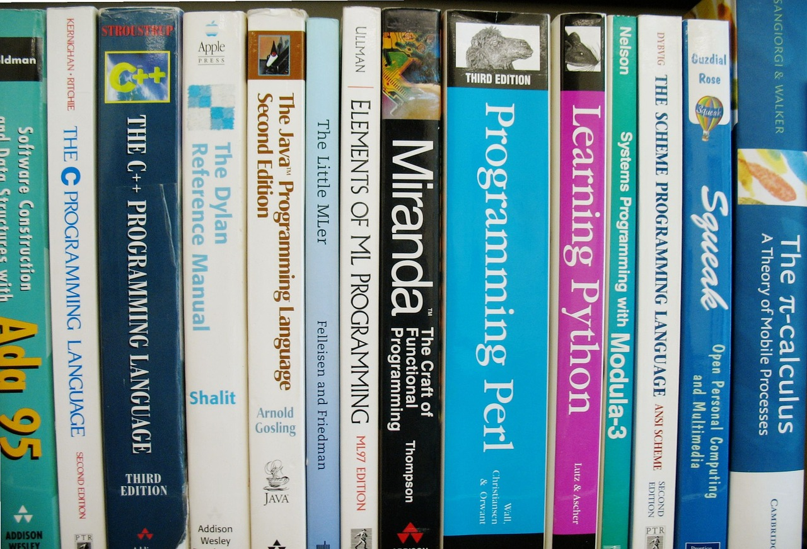
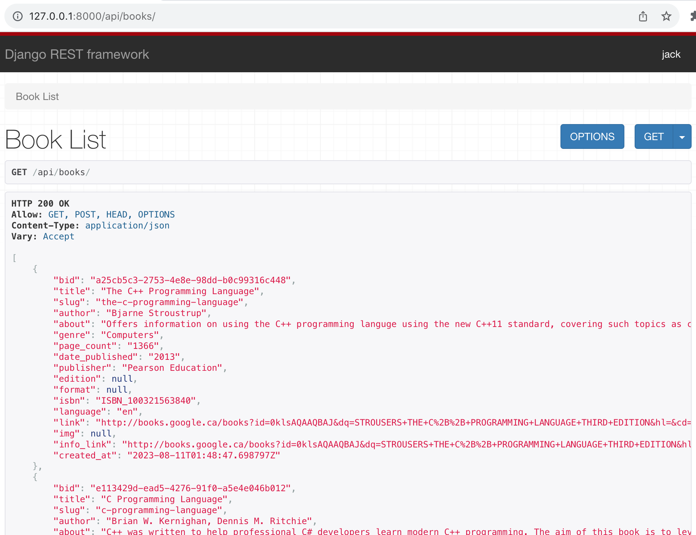

# Quick-Books
Quickly obtain a searchable database of many books.

## What it does
Takes images of bookshelves and catalogs each book into a database with detailed information like title, author(s), description, genre, page count, publisher, year published, isbn, reviews, price, etc.

## Usage
1. Place bookshelf images into shelf_imgs folder.
2. Ensure necessary libraries are installed and the server can be started with python3 manage.py runserver. Then run python3 manage.py makemigrations and python3 manage.py migrate.
3. Replace the variables in .env with your Google Books API key and replace the serviceacctoken.json with your Google Cloud token file.
4. From the ImageRecognition folder run the command python3 main.py
This will create individual book images in the spine_imgs folder as well as create a file called book_details.json containing all the information retrieved from the Books API.
5. From the backend folder run the command python3 manage.py importbook ../ImageRecongnition/book_details.json
This will load the books into the database.
6. The library can be accessed through localhost:port/api/books/ and individual books through localhost:port/api/books/(book-slug). Additionally creating a user with python3 manage.py createsuperuser will allow the user to use the admin panel and search for books.

A sample easy.jpg has been added to shelf_imgs. This image is the ideal image quality and almost all of the books are correctly identified. The current state of the repo has been executed on this image. As a result the spine_imgs can be found as well as book_details.json. Unforuntaly it's still not working 100% despite the good image quality. The errors here occur when the response from Vision API is passed directly into (bad idea) the Books API.

## To-do
- Improve the image recognition, specifically:
1. Allow images of multi-leveled bookshelves.
2. Improve the spine extraction when image quality is low.
3. Improve the book lookup request parameter. That is when the Google Vision API response we should do some processing prior calling the Google Books API. One idea is to use the Google Natural Language Processing API to extract Title and Author. The current issue is that sometime the Vision call will pickup numbers or other extraneous information that does not need to be there, which throws off the Books API call. If the Books API is passed only the Title and Author it is very likely to find the correct book.
- Create a frontend feature that allows user to confirm or reject books. This feature should show the spine image alongside the book data retrieved from Google Book API, then the user can make a decision to accept, reject, or modify it. Additionally implement a boolean validated field for the Book model to indicate whether or not a particular book has been accepted.
- Create a frontend feature that allows the user to upload there book images. The app could then be deployed and allow the user can access the site, upload images, then download the books in JSON or CSV.
- Improve the Book model and perhaps use a better database than sqllite, although i'm not sure why because it seems to handle everything fine at the moment.
- Create a frontend feature that displays the books like at munrobooks.com or russellbooks.com

## How it works
It splits the shelf images using several calls to the Open CV library, computing edges with Canny and an appropriate kernel alongside Houghlines are the main two. Further image processing is done to split and save the book spine images. These images are then fed to the Google Vision Text Detection endpoint. This text is then passed to the Google Books API (should be processed first) and the first search result returned is selected (could take a look at other responses to try to find the correct edition). The information from the Books API call is then added to a dictionary and after all the book spine images have been analyzed, the dictionary is save to book_details.json

## Resources
- https://web.stanford.edu/~bgirod/pdfs/Tsai_ACM_Multimedia_11.pdf

https://stackoverflow.com/questions/45322630/how-to-detect-lines-in-opencv

- How to use Google Cloud Platform with Python: https://www.youtube.com/@jiejenn

- Image processing with Open CV: https://docs.opencv.org/3.4/dd/dd7/tutorial_morph_lines_detection.html

- https://docs.python.org/3/library/itertools.html

- Used to help extract spines. spineExtraction.py in my project follows this repo very closely, although all code was rewritten from scratch: https://github.com/PierreAdel/Book-spine-extractor

https://cloud.google.com/docs

https://docs.opencv.org/3.4/d9/db0/tutorial_hough_lines.html